# lab2web
## Belajar Tag Dasar HTML Dan CSS
### CSS Dasar

Membuat Dokumen HTML
Ini adalah code dan tampilannya

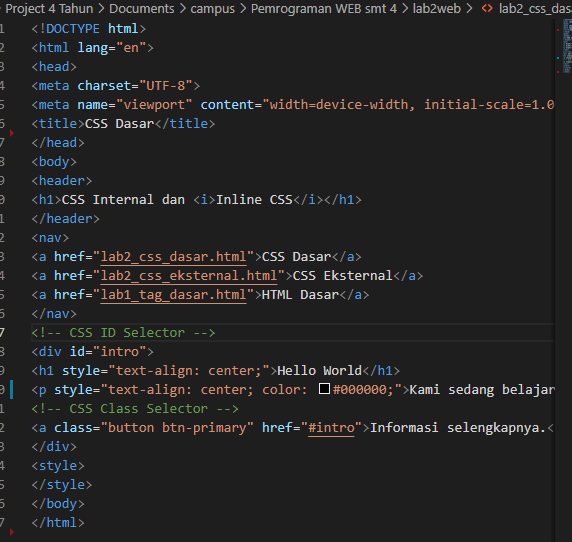

akan terlihat hasilnya seperti dibawah ini

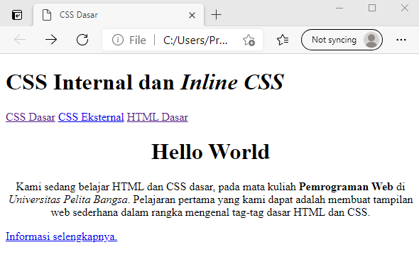

Mendeklarasikan CSS Internal
Kemudian tambahkan deklarasi CSS internal seperti berikut pada bagian head dokumen.
masukan code ini 

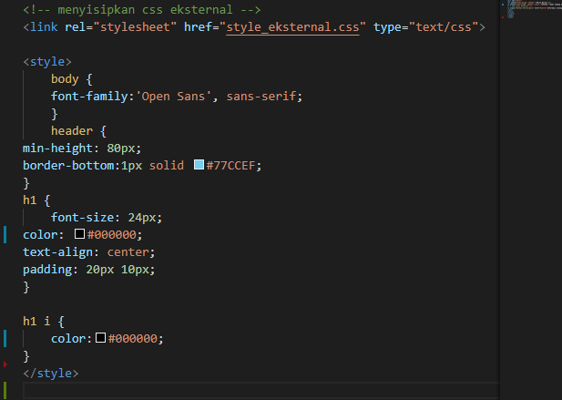

akan terlihat hasilnya seperti dibawah ini

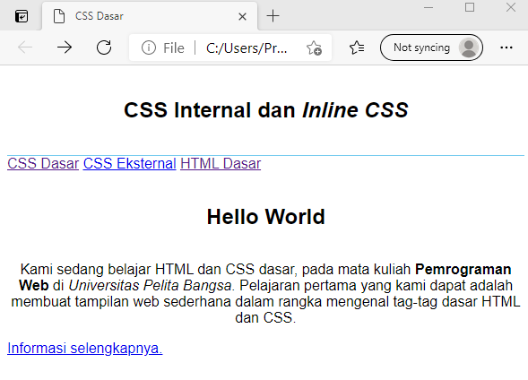

Menambahkan Inline CSS
Kemudian tambahkan deklarasi inline CSS pada tag 
 seperti berikut.

akan terlihat hasilnya seperti dibawah ini

Membuat CSS Eksternal
Buatlah file baru dengan nama style_eksternal.css kemudian buatlah deklarasi CSS seperti berikut

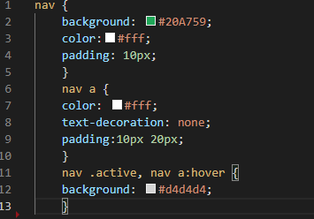

akan terlihat hasilnya seperti dibawah ini

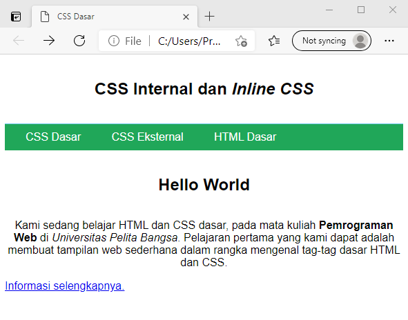

Kemudian tambahkan tag <link> untuk merujuk file css yang sudah dibuat pada bagian <head>

akan terlihat hasilnya seperti dibawah ini

Menambahkan CSS Selector
Selanjutnya   menambahkan   CSS   Selector   menggunakan   ID   dan   Class   Selector.   Pada   file
style_eksternal.css, tambahkan kode berikut. 

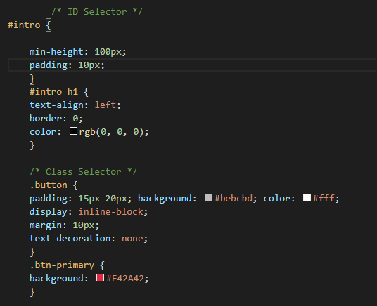

akan terlihat hasilnya seperti dibawah ini

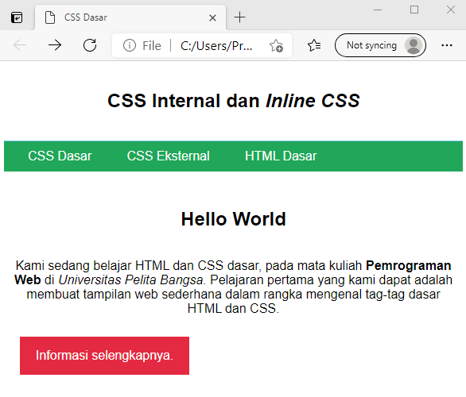

selanjutnya saya mencoba menambahkan background full jangan lupa memlikih foto untuk backgorund dan simpan di file lab2web
dengan memasukan code dibawah ini

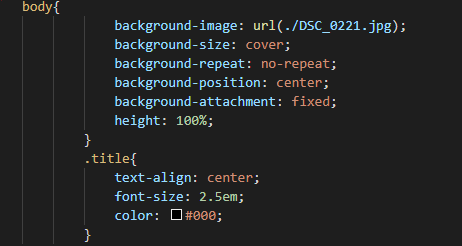

maka akan tampil seperti ini

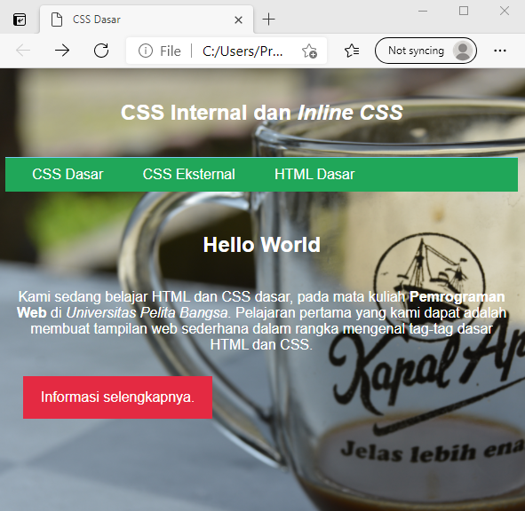

Pertanyaan dan Tugas
1.    Lakukan eksperimen dengan mengubah dan  menambah properti dan  nilai  pada  kode  CSS
dengan mengacu pada CSS Cheat Sheet yang diberikan pada file terpisah dari modul ini.
2.	Apa   perbedaan   pendeklarasian  CSS   elemen   h1   {...}   dengan   #intro   h1   {...}?   berikan penjelasannya!
3.    Apabila ada deklarasi CSS secara internal, lalu ditambahkan CSS eksternal dan inline CSS pada
elemen  yang  sama.  Deklarasi  manakah  yang  akan  ditampilkan  pada  browser?  Berikan penjelasan dan contohnya!
4.    Pada sebuah elemen HTML terdapat ID dan Class, apabila masing-masing selector tersebut
terdapat  deklarasi  CSS,  maka  deklarasi  manakah  yang  akan  ditampilkan  pada  browser? Berikan penjelasan dan contohnya!    ( 
 )

Jawaban 
1. sudah membuat diatas dengan beberapa perubahan
2. h1 adalah elemen itu sendiri untuk membuat heading teks sedangkan Intro h1 adalah id unik yang berasal dari elemen h1
3. yang akan tampil lebih dulu adalah CSS secara internal karena Perubahan hanya terjadi pada 1 halaman
Class dan ID bisa digunakan oleh internal stylesheet Tidak perlu meng-upload beberapa file karena HTML dan CSS bisa digunakan di file yang sama. Jika CSS Eksternal Halaman belum tampil secara sempurna hingga file CSS selesai dipanggil. jika menggunakan Inline CSS sangat tidak direkomendasikan karena harus Inline CSS harus diterapkan pada setiap elemen walaupun sangat simpel untuk perbaikan cepat.
4. Perbedaan dari class dan id adalah kelebihan unggul dari class yaitu dapat diberikan pada banyak element html dan dapat dipanggil sekaligus sedangkan id hanya dapat bekerja pada satu penandaan saja, maksudnya satu nama id hanya bisa id berikan pada satu element 
contoh 

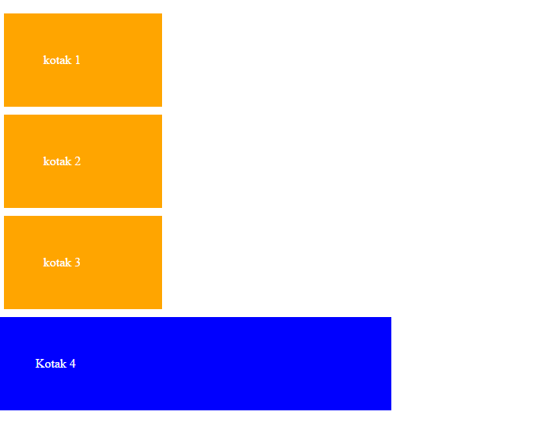

pada contoh diatas kotak 1,2,3 kita beri tanda dengan class yang diberi nama "kotak" dan kotak 4 kita beri dengan tanda id dengan nama kotak juga. maka perbedaannya akan tampak bahwa class bisa dipanggil sekaligus sedangkan id hanya 1